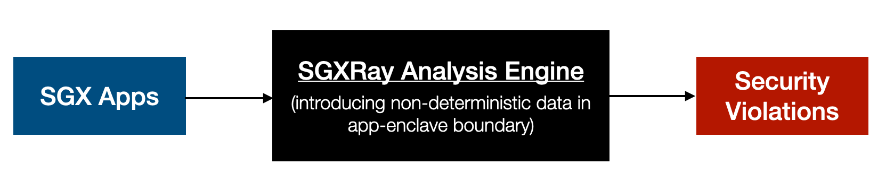

# SGXRay: Automating Vulnerability Detection for SGX Apps

Intel SGX protects isolated application logic and sensitive data inside an
enclave with hardware-based memory encryption. To use such hardware-based
security mechanism requires a strict programming model on memory usage，
with complex APIs in and out the enclave boundary.  Enclave developers 
are required to apply careful programming practices to ensure enclave security,
especially when dealing with data flowing across the enclave's trusted
boundary. Trusted boundary violations can further cause memory corruption and
are exploitable by attackers to retrieve and manipulate protected data.
Currently, no publicly available tools can effectively detect such issues for
real-world enclaves.

SGXRay is an open-source tool that automatically detects SGX enclave bugs
rooting from violations of trusted boundaries. It recompiles a given enclave
code and starts the analysis from a user-specified enclave function entry.
SGXRay can also enumerate and analyze all enclave entry functions automatically.
The goal of SGXRay is to effectively report enclave vulnerabilities exploitable 
by an attacker in the untrusted domain and automatically generate test cases
accordingly.

## Getting Started

The following figure demonstrates the workflow of SGXRay. The SGXRay analysis
engine takes SGX apps and introduces non-deterministic data to the app-enclave
boundaries. By analyzing the data/control flows, it ouptuts positions of
potential security violations.



Here is an overview of the usage of SGXRay command line interface:

```bash
# Change to the enclave directory and build the enclave.
$ cd enclave && sgxray build make

# SGXRay wll automatically collect ECall entrpoints for analysis.
$ sgxray analyze
2 ECall entrpoints found:
ecall_1(xx, xx)
ecall_2(xx, xx)

Analyzing ecall_1...
Introduce non-deterministic data: ocall_malloc...
Analyzing ecall_2...
Done...

4 potential violations found:
enclave.c (10, 11): memory access violation
enclave.c (20, 21): integer overflow
enclave.c (30, 21): memory leakage
enclave.c (30, 21): double free

# Speicify an individial ECall entrypoint.
$ sgxray analyze --entrypoint ecall_entrypoint
2 potential violations found:
...
```

## Case Study

Generally speaking, SGXRay tries to find out potential vulnerabilities caused by
untrusted inputs from app-enclave boundaries. These security violations can be
found in both Ecall (invoking trusted function) and Ocall (invoking untrusted
function) interfaces, resulting overwriting trusted memory, leaking trusted
memory, or even arbitrary code execution.

Let us see several concrete examples extracted from real-world
vulnerabilities in popular SGX frameworks.


### Example 1

The example tries to copy a sized buffer to the untrusted host. It calls
`ocall_untrusted_host_alloc` to allocate host memory and uses
`sgx_is_within_enclave` to check the return value. Then, it copies the sized
buffer into the checked host memory.

```C
int copy_to_host(uint8_t* buffer, size_t size)
{
    void *result;

    /* Allocate host memory */
    sgx_status_t status = ocall_untrusted_host_alloc(&result, size);
    if (status != SGX_SUCCESS || result == NULL)
        return -1;

    /* Check return value from host */
    if (sgx_is_within_enclave(result, size))
    {
        return -1;
    }

    /* Copy buffer to host memory when sgx_is_within_enclave returns false */
    uint8_t *untrusted_buffer = (uint8_t *)result;
    for (size_t i = 0; i < size; ++i)
    {
        untrusted_buffer[i] = buffer[i];
    }

    return 0;
}
```


The EDL file (defining app-enclave boundaries) is like this:

```
enclave {
    untrusted {
        void *ocall_untrusted_host_alloc(uint64_t size);
    };
};
```
However, checking a memory region is strictly outside an enclave with
`sgx_is_within_enclave` API is insufficient. If the checked buffer partially
lies outside the enclave's memory, `sgx_is_within_enclave` returns false. An
attacker can pass a pointer (buffer) that overlaps with the enclave memory
to bypass the check. As a result, the enclave memory is over-written by
copying data to the unstrusted_buffers.

Use SGXRay to detect the above security issue:

```bash
$ ./sgxray analyze
1 ECall entrpoints found

Analyzing vulnerable_ecall...
Introduce non-deterministic data...
Done...

1 potential violations found:
enclave.c: memory access violation
```

### Example 2
This example shows a server enclave with similar code snippets from the
[Linux
Manual](https://man7.org/linux/man-pages/man3/getaddrinfo.3.html#EXAMPLES).
It calls `getaddrinfo` to retrieve addresses from the host and tries to bind
a valid address. However, each addrinfo returned from the `getaddrinfo` API
is fully controlled by an attacker outside the enclave. The consequent `bind`
API can overread the enclave memory with the manipulated length
(`rp->ai_addrlen`) to the `rp->ai_addr` buffer and disclose it to the
attacker.

```C
void server_start() {
    struct addrinfo *result, *rp;
    int s, sfd;

    /* Retrieve addresses from host */
    s = getaddrinfo(NULL, "localhost", NULL, &result);  // call ocall_getaddrinfo
    if (s != 0) {
        fprintf(stderr, "getaddrinfo: %s\n", gai_strerror(s));
        exit(EXIT_FAILURE);
    }

    /* Try each address until sucessfully binded */
    for (rp = result; rp != NULL; rp = rp->ai_next) {
        sfd = socket(rp->ai_family, rp->ai_socktype,
                     rp->ai_protocol);
        if (sfd == -1)
            continue;

        /* rp->ai_addrlen can be controlled by attacker */
        if (bind(sfd, rp->ai_addr, rp->ai_addrlen) == 0)  // call ocall_bind
            break;

        close(sfd);
    }

    // ...
}
```

Use SGXRay to detect the above security issue:

```bash
$ ./sgxray analyze
1 ECall entrpoints found

Analyzing vulnerable_ecall...
Introduce non-deterministic data...
Done...

1 potential violations found:
enclave.c: memory leakage
```


## Demo

The following video demonstrates the usage of SGXRay
