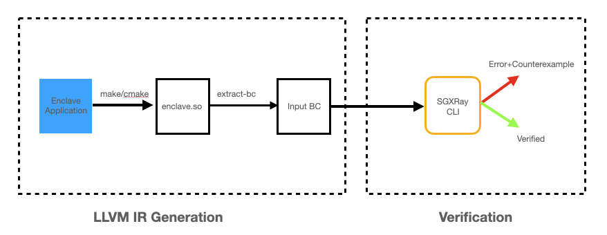

# SGXRay: Automating Vulnerability Detection for SGX Apps

Intel SGX protects isolated application logic and sensitive data inside an
enclave with hardware-based memory encryption. To use such hardware-based
security mechanism requires a strict programming model on memory usage，
with complex APIs in and out the enclave boundary.  Enclave developers 
are required to apply careful programming practices to ensure enclave security,
especially when dealing with data flowing across the enclave's trusted
boundary. Trusted boundary violations can further cause memory corruption and
are exploitable by attackers to retrieve and manipulate protected data.
Currently, no publicly available tools can effectively detect such issues for
real-world enclaves.

SGXRay is an automated reasoning tool based on the [SMACK](http://smackers.github.io/) verifier that automatically detects SGX enclave bugs
rooting from violations of trusted boundaries. It recompiles a given enclave
code and starts the analysis from a user-specified enclave function entry.
After the analysis, it either finds an invalid pointer handling inside an SGX software stack
such as deferencing unchecked pointer inside an enclave, invalid memory deallocation, and TOCTOU bugs,
or prove the absense of such bugs up to a user-specified loop and recursion bound.

Currently, SGXRay SGX applications built on two SGX SDKs: Intel SGX SDK and openenclave SDK.
Users can opt in SDK code for a more thorough analysis.

## Getting Started

For a quick start, please follow a step-by-step tutorial on using SGXRay over one of the demo examples [here](docs/tutorial.md).

The following figure demonstrates the workflow of SGXRay.



Running SGXRay is a two-step process. The first step is to obtain an LLVM IR file for the application.
The second step is to invoke SGXRay CLI for verification.

For the first step, we provide two Docker images for each SDK, respectively.
```bash
docker pull baiduxlab/sgx-ray-frontend-intel
docker pull baiduxlab/sgx-ray-frontend-oe
```
The detailed instructions to run the first step can be found [here](docs/bc-production.md).

For the second step, we also provide a Docker image.
```bash
docker pull baiduxlab/sgx-ray-distro:latest
```
The detailed instructions to run the second step can be found [here](docs/verification.md).

## Docker Build

We provide a Dockerfile that builds the image for the verification step.

```bash
git clone https://github.com/baiduxlab/sgxray.git && cd sgxray
docker build . -t sgx-ray-distro-local --build-arg hostuid=$UID -f Dockerfiles/Dockerfile-CLI
```
Successful build should produce an image named `sgx-ray-distro-local` which has an user `user` with the same user id as the host account.

## Documentations

Detailed documentations of SGXRay can be found as follows.

* [LLVM IR Generation](docs/bc-production.md)
* [Verification](docs/verification.md)
